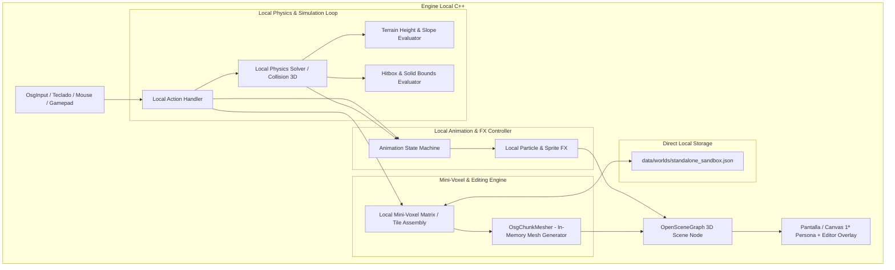

# ⚡ Reporte Técnico: Arquitectura y Especificación del Prototipo Standalone C++

**Modo Operativo:** Entorno Estrictamente Standalone (Engine + Map Editor Local en C++)  
**Regla de Oro:** **CERO RED, CERO SOCKETS, CERO `bridge_server`**  
**Objetivo Principal:** Procesamiento y resolución 100% local de físicas, colocación/interacción de mini-voxels, animaciones y Game Design dentro de la misma aplicación ejecutable.

---

## 📐 1. Filosofía y Justificación del Entorno Standalone

El propósito fundamental de esta especificación es eliminar toda latencia, sobrecoste de serialización binaria y dependencia de sockets durante la fase de afinación de **Game Design**.

En el modo arquitectura completa Servidor-Cliente, cada acción (mover un voxel, colisionar con una rampa, disparar un proyectil o abrir una puerta) requiere empaquetar un `OpCode`, transmitirlo por sockets TCP localloop, validar en `bridge_server`, responder con un snapshot y reconstruir la malla en `raycast_client`.

**Al adoptar la Regla del Prototipo Standalone:**
- **Zero Network Overhead:** Eliminación total de latencia de red, serialización y bucles de `PacketWriter`/`PacketReader`.
- **Feedback Loop Inmediato (60+ FPS):** Toda modificación física o visual ocurre en el mismo frame de renderizado.
- **Iteración de Game Design Ágil:** Las físicas de movimiento, colocación de mini-voxels, desniveles de terreno, animaciones y cámaras se prueban de manera directa.
- **Integración Engine + Editor:** Intercambio instantáneo (con una sola tecla o menú) entre la vista de juego en 1ª persona y las herramientas de edición de mapa.

---

## 🏛️ 2. Arquitectura de Módulos Locales (Sin Sockets)

El prototipo standalone unifica la autoridad de simulación y la representación visual en un único pipeline ejecutable en C++:



---

## 🛠️ 3. Componentes Fundamentales del Prototipo

### A. Motor de Físicas y Movimiento Autorizado Localmente
1. **Integración de `ServerPhysics` en Runtime Local:**
   - La lógica contenida en `bridge/ServerPhysics.cpp` (colisión de pared delgada `ThinWall`, pared ancha `ThickWall`, cajas delimitadoras y rampas) se acopla directamente en el bucle principal de actualización (`update(deltaTime)`).
2. **Evaluación Continua de Terreno (`terrain_height.h`):**
   - El cálculo de desniveles, elevación gradual al subir pendientes/escaleras y gravedad se procesa frame a frame localmente.
3. **Cálculo Directo de Línea de Visión (DDA `grid_dda.cpp`):**
   - Raycasting local instantáneo para determinar colisiones de disparos, selección de objetivos y alcance de interacción con ítems o mini-voxels.

### B. Sistema de Mini-Voxels y Colocación en Tiempo Real
1. **Grid / Matriz Sub-Métrica de Mini-Voxels:**
   - Cada casilla o *Tile* del mundo se puede subdividir en sub-bloques o mini-voxels (ej. 4x4 o 8x8 mini-voxels por casilla de terreno) para una edición detallada.
2. **Modificación Directa en Memoria (In-Memory Mutation):**
   - Al hacer clic o usar la herramienta de colocación, el voxel se inserta o destruye directamente en la estructura `EditorWorld` / `TileAssembly`.
3. **Reconstrucción Inmediata de Malla (`OsgChunkMesher`):**
   - En lugar de esperar un paquete `OP_RC_WORLD_CHUNK`, la malla OSG de la región afectada se invalida y regenera localmente en el mismo tick de render.
4. **Exportación e Importación Directa:**
   - Carga y guardado directo de la matriz de voxels hacia/desde `data/worlds/standalone_sandbox.json` sin intermediación de base de datos o servidor.

### C. Controlador Local de Animaciones y FX
1. **State Machine de Animaciones en C++:**
   - Transiciones de estado del jugador y criaturas (`Idle`, `Walking`, `Attacking`, `Casting`, `Hit`, `Death`) resueltas por un controlador local por frame.
2. **Proyectiles y Balística 3D Directa:**
   - `ClientMissileManager` actualiza las posiciones $X, Y, Z$ de las parábolas de misiles localmente sin requerir los paquetes `OP_RC_SHOOT_MISSILE`.
3. **Efectos Dinámicos en Overlays:**
   - Visualización inmediata de destellos, partículas, luces puntuales dinámicas (slots de luces 1–7) y animaciones de HUD.

### D. Modo Dual: Juego en Primera Persona ↔ Map Editor
1. **Conmutación Instantánea con Tecla de Acceso Directo (Hotkey):**
   - `Tecla F1` / `TAB`: Cambia entre cámara de juego en 1ª persona con física completa y cámara libre (FlyCam / Ortho) de editor.
2. **Herramientas de Edición In-Game:**
   - Pincel de mini-voxels, borrador, selector de materiales/texturas, ajuste de altura y colocación de luces locales integradas mediante interfaz visual ImGui/OSG Overlay.

---

## 📋 4. Especificación Técnica de Clases C++ para el Prototipo

Para implementar este entorno dentro del repositorio actual, se estructuran o reutilizan las siguientes clases C++ en modo embebido:

```cpp
namespace rc::standalone {

// Controlador principal del motor standalone (Zero sockets)
class StandaloneEngine {
public:
    bool initialize(const std::string& worldJsonPath);
    void update(float deltaTime);
    void render();

    // Conmutación de modo
    void setEditorMode(bool active);
    bool isEditorMode() const { return m_editorMode; }

    // Acciones de Mini-Voxels
    bool placeMiniVoxel(int32_t vx, int32_t vy, int32_t vz, uint16_t materialId);
    bool removeMiniVoxel(int32_t vx, int32_t vy, int32_t vz);

private:
    bool m_editorMode = false;
    
    // Subsistemas locales integrados (Sin red)
    std::unique_ptr<rc::EditorWorld> m_localWorld;
    std::unique_ptr<rc::LocalPhysicsSolver> m_localPhysics;
    std::unique_ptr<rc::OsgChunkMesher> m_localMesher;
    std::unique_ptr<rc::LocalAnimController> m_animController;
};

} // namespace rc::standalone
```

---

## 🔄 5. Comparativa: Modo Red vs. Modo Prototipo Standalone

| Parámetro / Característica | Modo Red Tradicional (`bridge_server` + `raycast_client`) | **Modo Prototipo Standalone (Local C++)** |
|---|---|---|
| **Arquitectura de Procesamiento** | Distribuida (Servidor Autoritativo + Cliente) | **Monolítica Local Unificada** |
| **Conexiones y Sockets** | Requeridos (`net_socket`, TCP, Handshake `OP_RC_WORLD_HELLO`) | **CERO RED / CERO SOCKETS** |
| **Latencia de Interacción** | Dependiente de bucle de red (10–50 ms) | **0 ms (Resolución en la misma memoria)** |
| **Edición de Mini-Voxels** | Petición -> Paquete -> Validación Server -> Evento | **Mutación directa de malla e invalidación de chunk local** |
| **Físicas y Colisiones** | Calculadas en `ServerPhysics.cpp` en proceso aparte | **Calculadas por `LocalPhysicsSolver` en el loop del cliente** |
| **Prueba de Game Design** | Requiere lanzar servidor y cliente coordinadamente | **Ejecución directa en 1 clic (Instant-Play)** |
| **Persistencia de Mapa** | Guardado vía SQLite / Server streaming | **Guardado directo a JSON local (`standalone_sandbox.json`)** |

---

## 🎯 6. Roadmap para Habilitar el Prototipo Standalone

1. **Creación del punto de entrada local:** Habilitar un target o flag de compilación (ej. `raycast_standalone.exe` o `--standalone`) en [`CMakeLists.txt`](file:///c:/OTRaycast-MV3D/CMakeLists.txt).
2. **Extracción de `LocalPhysicsSolver`:** Agrupar la lógica de colisión de `bridge/ServerPhysics.cpp` en `shared/` para que sea invocable sin dependencias de servidor.
3. **Binding de manipulación de Mini-Voxels:** Conectar el raycast de puntero del cliente (`OsgInput.cpp`) directamente con la modificación de casillas en `OsgChunkMesher.cpp`.
4. **Prueba de Game Design y Sensibilidad:** Ajustar velocidad de movimiento, fricción, colisiones de rampas y fluidez de colocación de bloques a 60 FPS ininterrumpidos.
